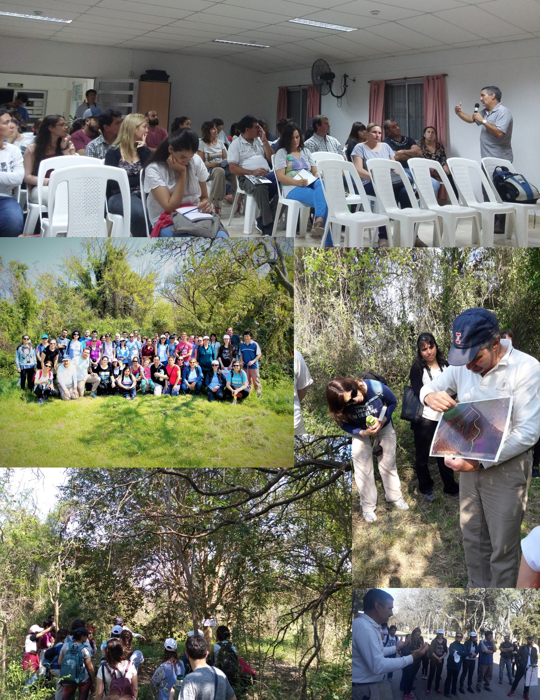
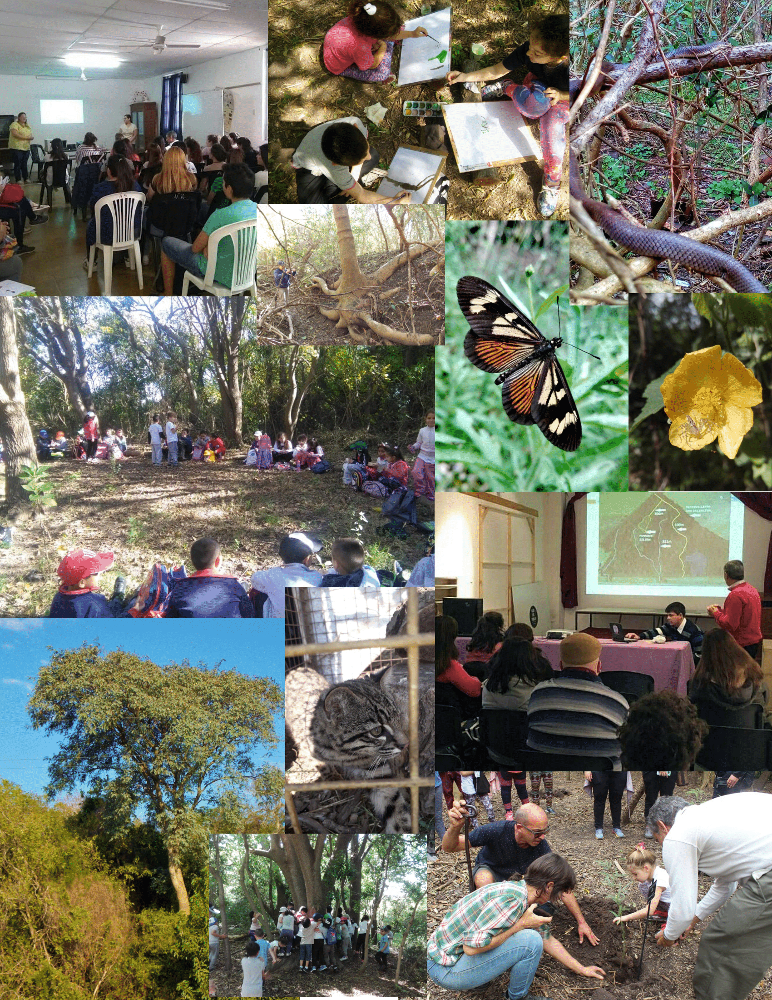
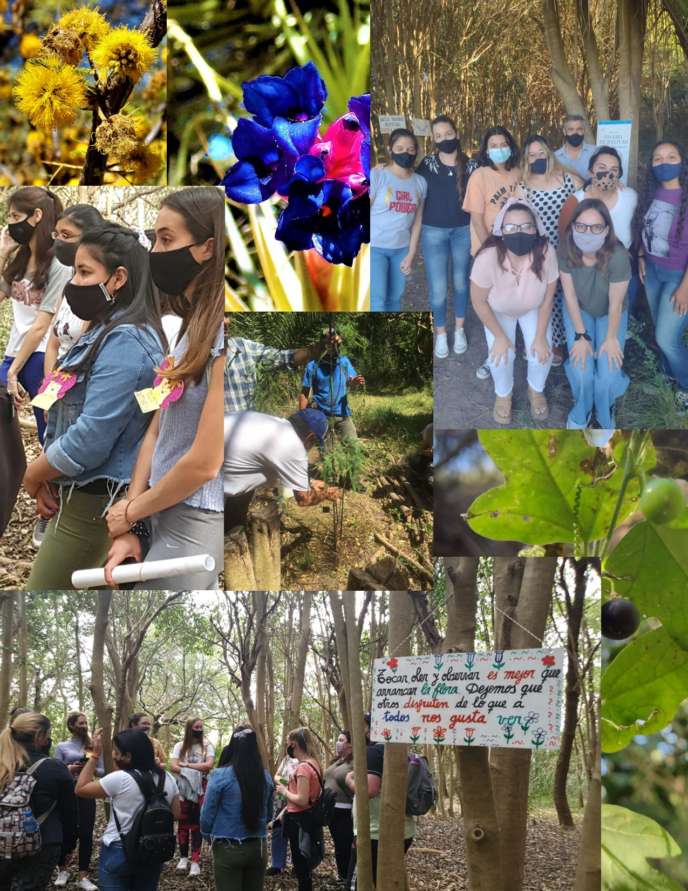
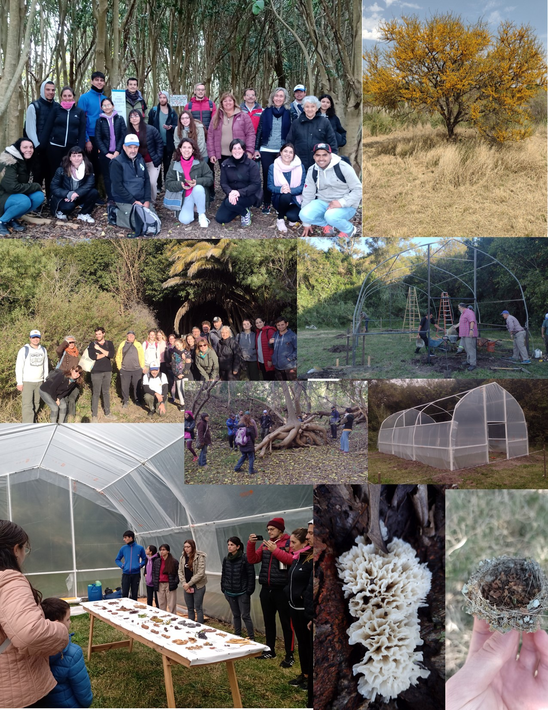
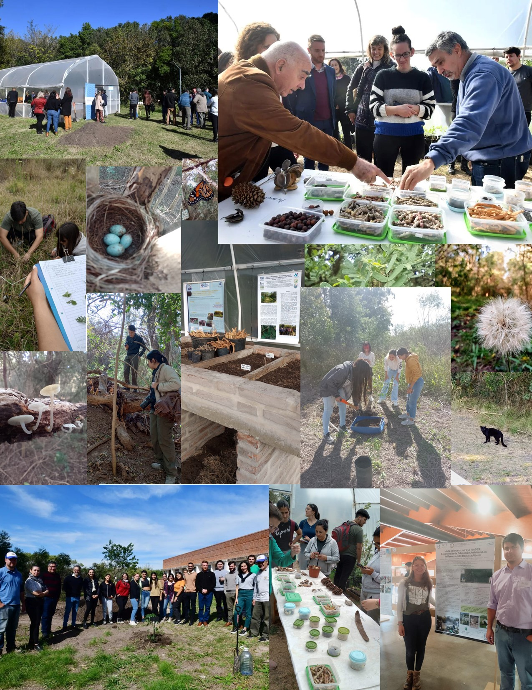

---
hide:
  - navigation
  - toc
---

<h3 class="texto_galeria">Material audiovisual de divulgación científica sobre aspectos ecológicos relevantes en la Reserva Alberdi. Este video se presentó en la Feria de Ciencia y Tecnología del 10 de Octubre de 2023 en la ciudad de Villaguay.</h3>

    <iframe width="800" height="500" src="https://www.youtube.com/embed/9IAFtBuWIxA?si=UREo9cSXhDmLJ0bk" title="YouTube video player" frameborder="0" allow="accelerometer; autoplay; clipboard-write; encrypted-media; gyroscope; picture-in-picture; web-share" referrerpolicy="strict-origin-when-cross-origin" allowfullscreen></iframe>

<h3 class="texto_galeria">Collage de fotos tomadas durante diversas actividades realizadas en la Reserva Alberdi.</h3>

Año 2018

Año 2019

Año 2020

Año 2021

Año 2022

Año 2023

