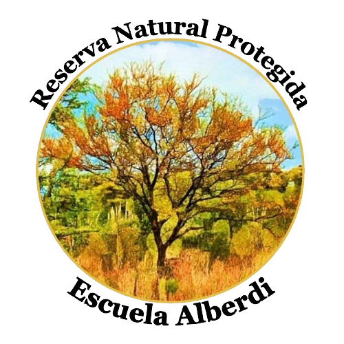

---
hide:
  - navigation
  - toc
---

<!DOCTYPE html>
<html lang="es">
<head>
    <meta charset="UTF-8">
    <meta name="viewport" content="width=device-width, initial-scale=1.0">
    <title>Reserva Escuela Juan Bautista Alberdi</title>
    <link rel="stylesheet" href="styles.css">
</head>
<body>
    

        <h1 id="reserva-juan-bautista-alberdi">Reserva de usos Múltiples Escuela Juan Bautista Alberdi</h1>

        
El área natural protegida <strong>Escuela Normal Rural Juan Bautista Alberdi</strong> forma parte del sistema de áreas naturales protegidas de la provincia de Entre Ríos, abarcando aproximadamente 20 hectáreas. La UADER, a través de la FCyT y la FHAyCS, colabora y coordina diversas actividades en este espacio.
         
        Contáctanos👇

 

            

                
            

            

                
            

            

                
            

        

        
    

</body>
</html>

