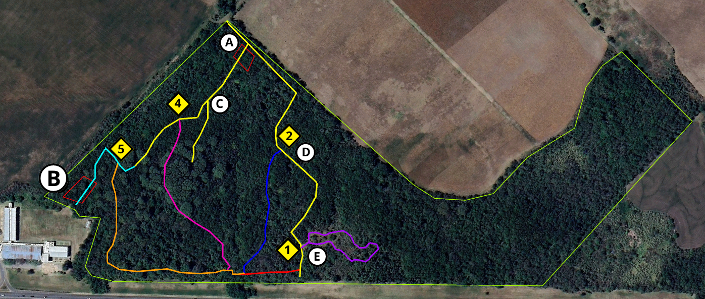
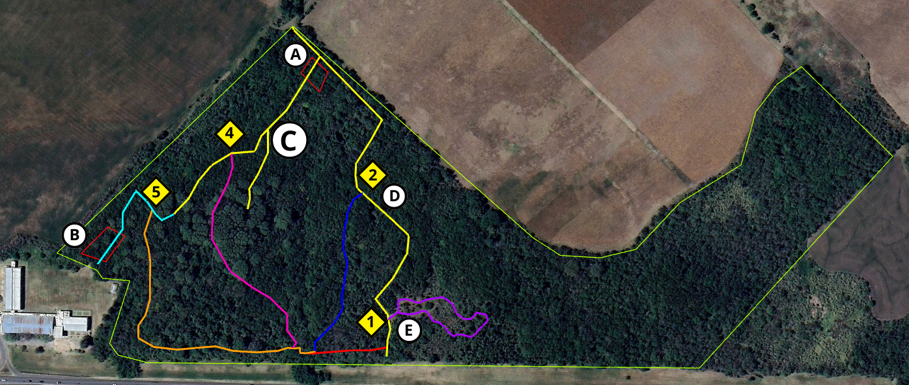

---
hide:
  - navigation
  - toc
---
# Recorridos de la Reserva

    <iframe 
        src="https://raw.githack.com/noelibaeza/reserva_natural_alberdi/main/qgis2web/index.html#14/-31.8384/-60.5346"
        style="width:100%; min-height:600px;" 
        allow="fullscreen"
        loading="lazy" 
        referrerpolicy="no-referrer-when-downgrade">
    </iframe>

    <a href="https://raw.githack.com/noelibaeza/reserva_natural_alberdi/main/qgis2web/index.html#14/-31.8384/-60.5346" 
       target="_blank" 
       class="open-button">
       Ver mapa en nueva pestaña
    </a>

<h2>Sendero Principal</h2>

<!--   -->
<h2><b>A</b> - Ingreso desde Escuela Alberdi</h2>

La Reserva Natural Protegida “Escuela Alberdi” cuenta con aproximadamente 20 ha de monte con diferentes microambientes atravesados por escurrimientos producidos por vertientes, presentan una variada composición vegetal y en ella habitan diferentes especies animales como <strong>guazuncho, zorro, ciervo axis, mulita, comadreja, lagarto overo, gato montés y hurón.</strong>

Creada en el año 1992, por iniciativa de docentes y estudiantes de la Escuela Normal Rural J. B. Alberdi, tiene por finalidad el resguardo del monte nativo y también la educación ambiental para la comunidad.
Aquí se encuentra un sector donde, previo a la creación de la Reserva “Escuela Alberdi”, se realizaba el depósito de residuos urbanos, provenientes de la Escuela Alberdi y Oro Verde, en un momento que la localidad aún no tenía el tamaño y población con el que cuenta hoy en día.
Este es uno de los puntos más elevados de la Reserva Escuela Alberdi, predomina como especie exótica invasora la mora <strong>(Morus sp.)</strong>, dispersada principalmente por aves que se alimentan de sus frutos. Sin embargo, por el arrastre provocado por el agua, se dispersaron, además de residuos, diferentes especies de plantas exóticas, algunas de ellas invasoras como <strong>ligustro</strong>(Ligustrum lucidum) y <strong> almez</strong>(Celtis australis), las cuales presentan frutos menos apetecibles por las aves.

<h2><b>B</b> - Ingreso desde Facultad de Ciencia y Tecnología</h2>

La Reserva Natural Protegida “Escuela Alberdi” cuenta con aproximadamente 20 has de monte con diferentes microambientes atravesados por escurrimientos producidos por vertientes, presentan una variada composición vegetal y en ella habitan diferentes especies animales silvestres.
Creada en el año 1992, por iniciativa de docentes y estudiantes de la Escuela Normal Rural J. B. Alberdi, tiene por finalidad el resguardo del monte nativo y también la educación ambiental para la comunidad.
En este punto, nos encontramos con una zona dominada por <strong>ligustros</strong> (Ligustrum lucidum), la cual es una especie exótica invasora, que representa la principal problemática de pérdida de diversidad dentro de la Reserva “Escuela Alberdi”. Esta especie compite con las especies nativas dominando el lugar, generando sombra durante todo el año, ya que es una especie perenne, que constantemente se encuentra acumulando hojas y ramas debajo de su copa, esto provoca que se modifiquen las condiciones del suelo como la humedad, incidencia del sol, pH y demás, lo que no permite que especies nativas puedan germinar debajo de esta invasora. Además, produce gran cantidad de semillas, las cuales, si pueden germinar y crecer en este ambiente y tienen una alta tasa de germinación, habiéndose contabilizado más de 2600 plántulas por m2.

<h2><b>C</b> - Sector con invasión de ligustro y contaminación residuos urbanos</h2>

Monte de especies exóticas, dominado por <strong>ligustros</strong> (Ligustrum lucidum), la cual es una especie exótica muy invasora, que representa la principal problemática de pérdida de diversidad dentro de la Reserva “Escuela Alberdi”. Esta especie compite con las especies nativas dominando el lugar, generando sombra durante todo el año, ya que es una especie perenne, que constantemente se encuentra acumulando hojas y ramas debajo de su copa, esto provoca que se modifiquen las condiciones del suelo como la humedad, incidencia del sol, pH y demás, lo que no permite que especies nativas puedan germinar debajo de esta invasora. Además, produce gran cantidad de semillas, las cuales, si pueden germinar y crecer en este ambiente y tienen una alta tasa de germinación, habiéndose contabilizado más de 2600 plántulas por m2.
Se observa también, presencia de residuos urbanos que fueron desplazados por el agua desde el lugar donde se depositaron en años previos a que este lugar sea un área protegida.

<h2><b>D</b> - Sector experimental de control de especies exóticas invasoras</h2>

Sector de experimentación, donde se realizaron diferentes manejos y control de especies de plantas exóticas invasoras como <strong>ligustros</strong> (Ligustrum lucidum), <strong>moras</strong>  (Morus sp.) y <strong>helechos plumosos</strong>  (Asparagus setaceus).
Se efectuó la extracción mecánica de juveniles, renovales y especímenes adultos de ligustro y mora en un “modelo en espejo” a cada lado del sendero principal, teniendo una extensión a cada lado de 10x30m de espació despejado. Solo se dejaron ejemplares de especies nativas como <strong>chañar</strong>   (Geoffroea decorticans), <strong>curupí</strong> (Sapium haematospermum), <strong>jacarandá</strong>   (Jacaranda mimosifolia), <strong>canelón</strong>   (Myrsine laetevirens),  <strong>tala</strong>  (Celtis tala),  <strong>espinillo</strong>  (Vachellia caven), diferentes especies de herbáceas, lianas y epifitas. Además, se plantaron ejemplares de <strong>algarrobo negro</strong> (Prosopis nigra), <strong>algarrobo blanco</strong> (Prosopis alba),  <strong>ñandubay</strong>  (Prosopis affinis) y  <strong>espinillo</strong>  (Vachellia caven).
Conjuntamente a la extracción, se realizó el anillado en la base de ejemplares de gran tamaño de ligustro, para provocar la muerte en pie de estos y así evitar que al cortarlo completo al caer, pudieran dañar ejemplares de especies nativas que se quieren preservar.
 

<h2><b>E</b> - Pastizal natural</h2>
Pastizal natural con presencia de renovales de <strong>chañar</strong> (Geoffroea decorticans). En este espacio se pueden observar gran cantidad de aves tales como <strong>tacuarita azul</strong> (Polioptila dumicola), <strong>zorzal</strong> (Turdus rufiventris), <strong>benteveo</strong> (Pitangus sulphuratus), <strong>chororo</strong> (Taraba major), <strong>pepitero</strong> (Saltator aurantiirostris), <strong>taguató</strong> (Rupornis magnirostris) , <strong>loro</strong> (Myiopsitta monachus), <strong>espinero</strong> (Phacellodomus ruber), <strong>hornero</strong> (Furnarius rufus), entre otras. Además de ser el hábitat de varios roedores como ratón colilargo</strong> (Oligoryzomys flavescens), <strong>ratón hocicudo rojizo</strong> (Oxymycterus rufus ) y <strong>ratón de pastizal pampeano</strong> (Akodon azarae).

## Recorridos extras

- [ Ingreso Sendero 1](sendero1.md)
- [ Ingreso Sendero 2](sendero2.md)
- [ Ingreso Sendero 4](sendero4.md)
- [ Ingreso Sendero 5](sendero5.md)

