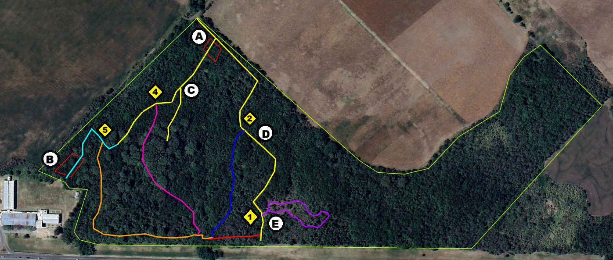

---
hide:
  - navigation
  - toc
---
# Recorridos de la Reserva

    <iframe 
        src="https://raw.githack.com/noelibaeza/reserva_natural_alberdi/main/qgis2web/index.html#14/-31.8384/-60.5346"
        style="width:100%; min-height:600px;" 
        allow="fullscreen"
        loading="lazy" 
        referrerpolicy="no-referrer-when-downgrade">
    </iframe>

    <a href="https://raw.githack.com/noelibaeza/reserva_natural_alberdi/main/qgis2web/index.html#14/-31.8384/-60.5346" 
       target="_blank" 
       class="open-button">
       Ver mapa en nueva pestaña
    </a>

<h2>Sendero Principal</h2>

 <h2>Ingreso desde Escuela Alberdi</h2>

La Reserva Natural Protegida “Escuela Alberdi” cuenta con aproximadamente 20 ha de monte con diferentes microambientes atravesados por escurrimientos producidos por vertientes, presentan una variada composición vegetal y en ella habitan diferentes especies animales como <strong>guazuncho, zorro, ciervo axis, mulita, comadreja, lagarto overo, gato montés y hurón.</strong>
Creada en el año 1992, por iniciativa de docentes y estudiantes de la Escuela Normal Rural J. B. Alberdi, tiene por finalidad el resguardo del monte nativo y también la educación ambiental para la comunidad.
Aquí se encuentra un sector donde, previo a la creación de la Reserva “Escuela Alberdi”, se realizaba el depósito de residuos urbanos, provenientes de la Escuela Alberdi y Oro Verde, en un momento que la localidad aún no tenía el tamaño y población con el que cuenta hoy en día.
Este es uno de los puntos más elevados de la Reserva Escuela Alberdi, predomina como especie exótica invasora la mora <strong>(Morus sp.)</strong>, dispersada principalmente por aves que se alimentan de sus frutos. Sin embargo, por el arrastre provocado por el agua, se dispersaron, además de residuos, diferentes especies de plantas exóticas, algunas de ellas invasoras como <strong>ligustro</strong>(Ligustrum lucidum) y <strong> almez</strong>(Celtis australis), las cuales presentan frutos menos apetecibles por las aves.

