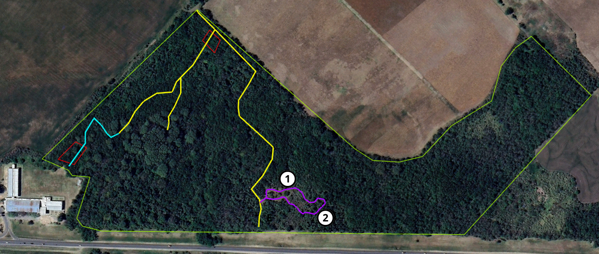

<h2>Sendero 1 - no habilitado</h2>

<h2><b>1</b> - Pastizal natural con renovales de chañar y espinillo </h2>

Pastizal natural con presencia de renovales de chañar (Geoffroea decorticans). En este espacio se pueden observar gran cantidad de aves tales como tacuarita azul (Polioptila dumicola), zorzal (Turdus rufiventris), benteveo (Pitangus sulphuratus), chororo (Taraba major), pepitero (Saltator aurantiirostris), taguató (Rupornis magnirostris) , loro (Myiopsitta monachus), espinero (Phacellodomus ruber), hornero (Furnarius rufus), entre otras. Además de ser el hábitat de roedores como ratón colilargo (Oligoryzomys flavescens), ratón hocicudo rojizo (Oxymycterus rufus ) y ratón de pastizal pampeano (Akodon azarae).
 
<h2><b>2</b> - Pastizal alto con sucesión de cortaderas, chilcas, curupíes, chañar, etc.</h2>

Sucesión en pastizal con presencia de herbáceas como cortaderas (Cortaderia araucana), además de chilcas (Baccharis sp.) y especies arbóreas como chañar (Geoffroea decorticans), curupí (Sapium haematospermum), tala (Celtis tala), espinillo (Vachellia caven), molle (Schinus longifolia), entre otras.
