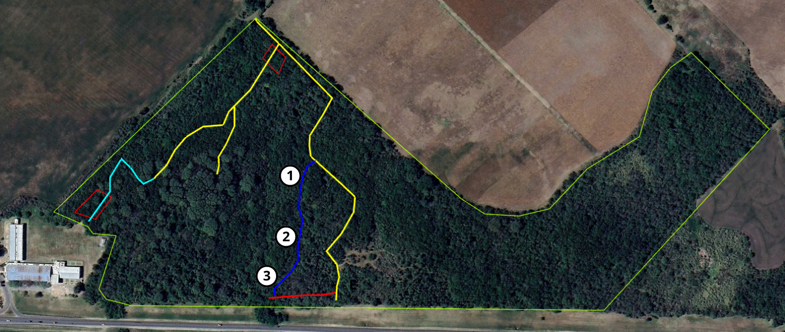

<h2>Sendero 2 - no habilitado</h2>

<h2><b>1</b> - Monte con invasión de ligustro </h2>

Monte de exóticas, dominado por ligustros (Ligustrum lucidum), la cual es una especie exótica invasora, que representa la principal problemática de pérdida de diversidad dentro de la Reserva “Escuela Alberdi”. Esta especie compite con las especies nativas dominando el lugar, generando sombra durante todo el año, ya que es una especie perenne, que constantemente se encuentra acumulando hojas y ramas debajo de su copa, esto provoca que se modifiquen las condiciones del suelo como la humedad, incidencia del sol, pH y demás, lo que no permite que especies nativas puedan germinar debajo de esta invasora. Además, produce gran cantidad de semillas, las cuales, si pueden germinar y crecer en este ambiente y tienen una alta tasa de germinación, habiéndose contabilizado más de 2600 plántulas por m2
 
<h2><b>2</b> - Claro en el bosque, inicio de sucesión ecológica</h2>

Claro en monte, generado por caída de ejemplares arbóreas, se encuentra en estadio de sucesión ecológica, donde diferentes especies de herbáceas ocupan el espacio, y comienzan a aparecer renovales de tala (Celtis sp.) en competencia con exóticas como ligustro (Ligustrum lucidum).

<h2><b>3</b> - Confluencia de arroyos, microambiente con palmeras washintonia y canaria, tembetarí
</h2>

Sector donde confluyen diferentes escurrimientos que atraviesan la reserva, es el punto más bajo de la misma. Se puede observar importante presencia de palmeras exóticas como washintonia (Washingtonia robusta) y canaria (Phoenix canariensis), las cuales provendrían de la zona alta donde se encuentra el sector de residuos, presumiblemente habrían llegado frutos desde allí que fueron arrastrados por el agua hacia este sector.

