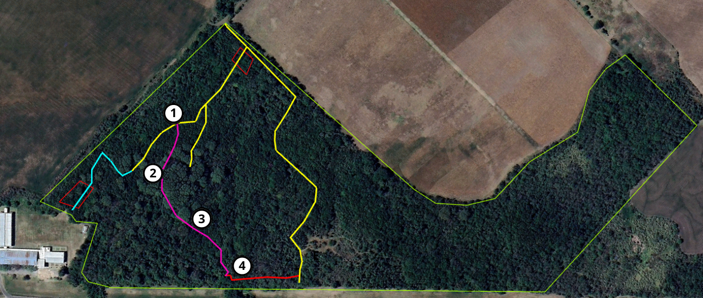

<h2>Sendero 4</h2>

<h2><b>1</b> - Inicio Sendero 4, Ombú de gran tamaño</h2>

Este sendero aprovecha el cauce seco de un escurrimiento por vertientes. En su inicio, se encuentra un gran ombú (Phytolacca dioica), el cual presenta uno de sus tallos principales recostado y brotando. Sus raíces, dejan huecos que son aprovechados como refugio por diferentes animales como mulita (Dasypus hybridus), hurón (Galictis cuja), zorro (Lycalopex gymnocercus), lagarto overo (Salvator merianae), entre otras.
 
<h2><b>2</b> - Recorrido por escurrimiento, sector doble techo de tipas, algarrobos añejos sosteniendo las terrazas altas originales</h2>

La presencia de tipas (Tipuana tipu), genera una situación un doble techo, ya que esta especie crece a una altura mayor que las especies nativas del espinal en general y de la selva en galería, pero también tiene mayor altura que exóticas como el ligustro (Ligustrum lucidum), lo que permite un control parcial en el avance de dicha especie.
En la parte alta se observan ejemplares añejos de algarrobo negro (Prosopis nigra), los cuales son propios del Monte del Espinal original. Estos y otras especies, sostienen el terreno de las terrazas altas con sus raíces, previniendo la erosión total del mismo.

<h2><b>3</b> - Erosión hídrica, pérdida de biodiversidad por ligustros</h2>

Se puede diferenciar a simple vista una diferencia de tiempos de erosión provocada por el agua. En este sector, el escurrimiento tiene una forma ancha y suave respecto de los laterales hacia el fondo del mismo, forma de un pequeño delta, indicando que es una erosión de mayor antigüedad. Mientras que, all inicio del sendero, el escurrimiento es mucho más angosto y con forma de V, lo que indica un tiempo de erosión más reciente.

<h2><b>4</b> - Confluencia de arroyos, microambiente con palmeras washintonia y canaria, tembetarí
</h2>

Sector donde confluyen diferentes escurrimientos que atraviesan la reserva, es el punto más bajo de la misma. Se puede observar importante presencia de palmeras exóticas como washingtonia (Washingtonia robusta) y canaria (Phoenix canariensis), las cuales provendrían de la zona alta donde se encuentra el sector de residuos, presumiblemente habrían llegado frutos desde allí que fueron arrastrados por el agua hacia este sector.

