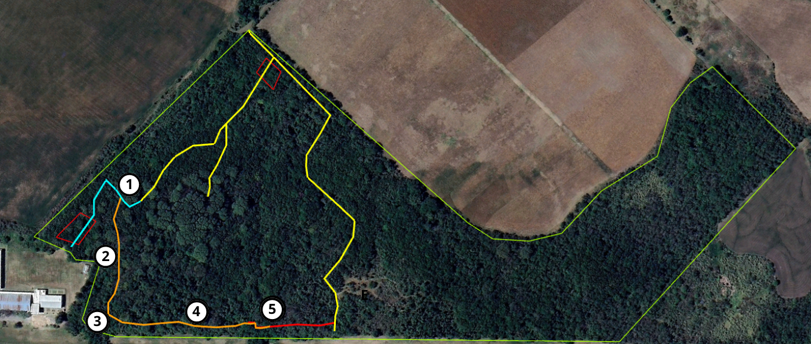

<h2>Sendero 5</h2>

<h2><b>1</b> - Inicio Sendero 5: estrato en forma de “selva en galería”, abundancia de guayabo colorado, presencia de ligustro
</h2>

Presencia de especies propias de la selva en galería como guayabo colorado, canelón, tembetarí, etc.
 
<h2><b>2</b> - Problemática helecho plumoso, doble techo de jacarandas</h2>

Comienza a observarse el avance abundante de helechos plumosos (Asparagus setaceus), una especie de enredadera exótica de tipo invasora, que puede reproducirse sexualmente, generando frutos buscados por las aves, y también de forma asexual mediante rizomas. Sus tallos crecen afilos hasta alcanzar copas o ramas altas donde llegue la luz, allí generan su desarrollo foliar, cubriendo toda la copa o ramas de las especies hospedadoras, provocando que estas se sequen y colapsen completamente, en caso de cobertura total de copas, o parcialmente, cuando los ejemplares son de gran altura y solo afecta ramas hasta los 5 o 6m de altura como ocurre con los jacarandá (Jacaranda mimosifolia).
La presencia de jacarandá (Jacaranda mimosifolia), genera una situación un doble techo, ya que esta especie crece a una altura mayor que las especies nativas del espinal en general y de la selva en galería, pero también tiene mayor altura que exóticas como el ligustro (Ligustrum lucidum), lo que permite un control parcial en el avance de dicha especie.

<h2><b>3</b> - Fin de paleo-cauce, bandera española, acumulación de sedimentos, etapa de enredaderas varias.
</h2>
Antiguo cauce del arroyo, el cual continuó su recorrido unos metros más al norte. Se puede observar en el suelo acumulación de sedimentos y materia orgánica en el sendero. Además, destaca la presencia de bandera española (Lantana camara), una arbustiva que en ocasiones puede comportarse como trepadora, como también <b>malvavisco silvestre</b> (abutilon grandifolium). Así mismo, se puede observar presencia de <b>helechos plumosos</b> (Asparagus setaceus) en diferentes estadios, desde plántulas nuevas hasta aquellas bien desarrolladas generando la sobrecarga de ramas en los árboles. 

<h2><b>4</b> - Monte nativo del espinal, grandes algarrobos, terreno elevado, problemática de la ruta.
</h2>
Monte nativo con presencia de especies propias de la Ecorregión Espinal como <b>algarrobo negro</b> (Neltuma nigra), <b>ñandubay</b> (Neltuma affinis), <b>tala</b> (Celtis sp.), <b>chañar</b> (Geoffroea decorticans), <b>molle</b> (Schinus longifolia), <b>palo tinta</b> o <b>virajú</b> (Achatocarpus praecox), <b>ombú</b> (Phytolacca dioica), entre otras. 
Es un terreno elevado, donde la colonización de especies exóticas invasoras como ligustro o mora aún se ven muy reducidas, principalmente porque la primera de ellas se observó que se relaciona su dispersión en mayor relación a los cursos de agua.
La problemática principal en este sector es la cercanía con la Ruta Provincial N°11, siendo la contaminación sonora lo que detectamos desde el sendero, pero además es una barrera entre la Reserva Esc. Alberdi y el la Reserva del Jardín Botánico de UNER, dificultando el paso de diferentes especies de animales, que en ocasiones se han encontrado atropellados.

<h2><b>5</b> - Confluencia de arroyos, microambiente con palmeras washintonia y canaria, tembetarí.

</h2>

Sector donde confluyen diferentes escurrimientos que atraviesan la reserva, es el punto más bajo de la misma. Se puede observar importante presencia de palmeras exóticas como washingtonia (Washingtonia robusta) y canaria (Phoenix canariensis), las cuales provendrían de la zona alta donde se encuentra el sector de residuos, presumiblemente habrían llegado frutos desde allí que fueron arrastrados por el agua hacia este sector.

